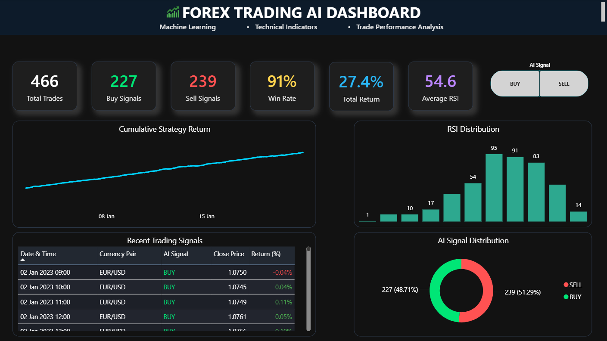
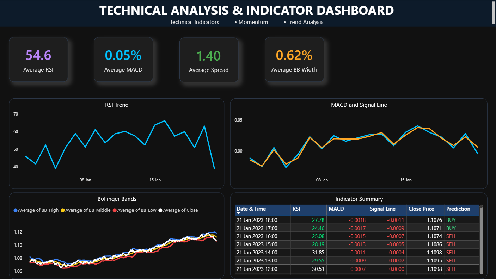

# 📈 Forex Trading AI Dashboard

An end-to-end AI-powered Forex Trading Dashboard built using **Python, Machine Learning, and Power BI**. This project predicts Buy/Sell trading signals using technical indicators and presents interactive analytics through a professional Power BI dashboard.

---

## 🚀 Project Overview

This project combines technical analysis, machine learning, and business intelligence to build an intelligent Forex Trading Analytics system.

The workflow includes:

- Data preprocessing using Python
- Technical Indicator generation
- Machine Learning model training
- Trading Signal prediction
- Interactive Power BI Dashboard

---

## 📊 Dashboard Features

### Executive Dashboard

- Total Trades
- Buy Signals
- Sell Signals
- Win Rate
- Total Return
- Average RSI
- Cumulative Strategy Return
- RSI Distribution
- AI Signal Distribution
- Recent Trading Signals

---

### Technical Analysis Dashboard

- Average RSI
- Average MACD
- Average Spread
- Average Bollinger Band Width
- RSI Trend
- MACD vs Signal Line
- Bollinger Bands
- Indicator Summary Table

---

## 🤖 Machine Learning Pipeline

Model Used:

- Random Forest Classifier

Technical Indicators:

- RSI (Relative Strength Index)
- MACD
- MACD Signal
- SMA 10
- SMA 20
- EMA 10
- Bollinger Bands
- Spread

Target Variable:

- Buy / Sell Prediction

---

## 🛠 Technologies Used

- Python
- Pandas
- NumPy
- Scikit-Learn
- TA Library
- Joblib
- Power BI
- DAX
- GitHub

---

## 📸 Dashboard Preview

### Executive Dashboard



### Technical Analysis Dashboard



---

## ⚙️ Installation

Clone the repository

```bash
git clone https://github.com/Sohamdas08/Forex-Trading-AI-Dashboard.git
```

Install dependencies

```bash
pip install -r python/requirements.txt
```

Run the Python pipeline

```bash
python python/forex_ai_pipeline.py
```

Open the Power BI dashboard

```
dashboard/Forex_Trading_AI_Dashboard.pbix
```

---

## 📈 Project Workflow

Raw Forex Data

↓

Technical Indicator Engineering

↓

Machine Learning Model Training

↓

Trading Signal Prediction

↓

Power BI Dashboard

↓

Business Insights

---

## 🎯 Project Highlights

✔ End-to-End Machine Learning Pipeline

✔ Technical Indicator Engineering

✔ Power BI Interactive Dashboard

✔ Trading Signal Prediction

✔ Professional GitHub Repository

---

## 👨‍💻 Author

**Soham Das**

GitHub:
https://github.com/Sohamdas08
LinkedIn:
https://www.linkedin.com/in/soham-das-884a1a315/?skipRedirect=true

---

## ⭐ If you found this project useful, consider giving it a star.
